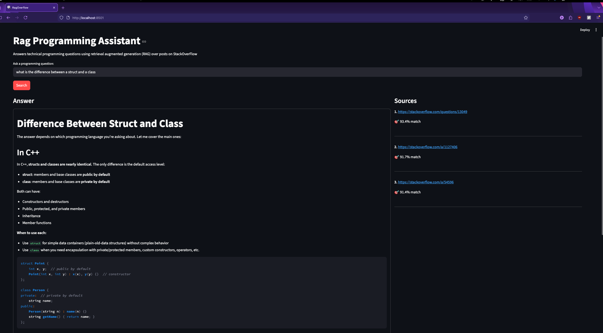

# RagProgrammingAssistant
AI programming assistant that uses Retrieval-Augmented Generation (RAG) to answer technical programming questions, using LLM-enhanced responses from [Stack Overflow](https://stackoverflow.com/)	

## UI demo


## RAG Architecture
RagOverflow combines semantic search with LLMs to provide accurate answers to programming questions. 
It retrieves relevant Stack Overflow content via vector similarity search and uses Claude AI to synthesize responses with source references 
```
User Query (Natural Language) 
    ↓
[1] Embed Query using a pretrained transformer 
    ↓
[2] Perform a Semantic Search (PineconeDB) → Returns IDs of the top 3 most similar posts (using cosine simlarity)  
    ↓
[3] Fetch Full Context for LLM Prompt (DuckDB) → Questions + Answers
    ↓
[4] Generate a textual response to the user query by prompting an LLM → Synthesized response
    ↓
[5] Return LLM responses with Source URLs
```

## Technologies
- Backend: FastAPI (REST API server), Pinecone (cloud vector database), DuckDB (embedded OLAP SQL database), LangChain (LLM framework), Claude Sonnet 4 (AI model) 
- Data Pipeline: sentence-transformers (provides pretrained natural language embeddings models), Pandas (data processing), Beautiful Soup (HTML cleaning), Jupyter notebooks (data analysis)
- Frontend: Streamlit (web UI)
- Infrastructure: Docker & docker-compose (containerization)

## How this project was built as a college student (for less than $1) 
The only financial cost of this project was the Claude Haiku API key, which is $1 per 1 million tokens

1. Downloaded Stack Overflow data dump (~100 GB XML) from archive.org
2. Analyzed the data in Jupyter notebooks to understand post distribution, votes, tags
3. Determined filtering strategy: Pinecone free tier = 2 GB limit, so filtered for posts with ≥65 upvotes → 275,000 high-quality posts
   - Created a cloud vector DB index on Pinecone using their free tier, hosted on AWS 
4. Built 3-stage data pipeline:
   - Stage 1: Parse XML → Clean HTML → Store in DuckDB (~200 MB)
   - Stage 2: Generate 384-dim embeddings using BGE model (pretrained transformer) → Save to Parquet (~623 MB)
   - Stage 3: Upload embeddings + metadata to Pinecone cloud index (~443 MB, 22% of free tier)
5. Developed full-stack web app:
   - Backend: FastAPI `/query` endpoint that performs semantic search against our cloud-hosted vector DB → fetches content from DuckDB → generates LLM response
   - Frontend: Streamlit UI with query input, answer display (left panel), and source links with similarity scores (right panel)
6. Containerized with Docker for easy deployment

## Quick Start

### Running with Docker (Recommended)
```bash
# 1. Clone the repository
git clone https://github.com/DunnyBunny1/RagProgrammingAssistant
cd ragoverflow

# 2. Set up environment variables
cp .env.template .env
# Edit .env with your credentials / api keys 

# 3. Run the application
docker-compose up --build
```

The application will be available at:
- **Frontend:** http://localhost:8501
- **Backend API:** http://localhost:8000
- API documentation available at  http://localhost:8000/docs 

### Local Development Setup

For local development without Docker: (using Python 3.12)
```bash
# Install dependencies (from project root)
pip install -r backend/requirements.txt
pip install -r frontend/requirements.txt
pip install -r shared/requirements.txt

# Run backend
cd backend
python server.py 

# Run frontend (separate terminal)
cd frontend
python app.py
```

> **Note:** All `pip install` commands must be run from the project root directory, as dependencies reference the `shared` package with a relative path.

#### Data Pipeline & Notebooks

To explore data processing or run Jupyter notebooks:
```bash
# Install data pipeline dependencies
pip install -r data_pipeline/requirements.txt

# Start JupyterLab
jupyter lab

# Run the scripts to process data  
python data_pipeline/scripts/01_load_xml_dump_data_to_duck_db.py
python data_pipeline/scripts/02_generate_embeddings_to_parquet.py
python data_pipeline/scripts/03_upload_embeddings_to_cloud_vectordb.py
```

Notebooks are located in `data_pipeline/notebooks/`.


## Future Optimizations  
- **Text chunking:** Implement proper chunking strategy instead of truncating posts that exceed 512 token limit
- **Conversation history:** Enable multi-turn conversations with context retention
- **Streaming responses:** Stream LLM output token-by-token for better UX instead of waiting for full response
- **Model selection:** Add dropdown in frontend to toggle between LLMs (Claude Sonnet, GPT-4o-mini, etc.)
- **Improved answer coverage:** Lower vote threshold for answers to improve Q&A pairing (currently some questions lack answers due to 65+ vote filter)
- **Re-ranking:** Add re-ranking layer after retrieval to improve result quality
